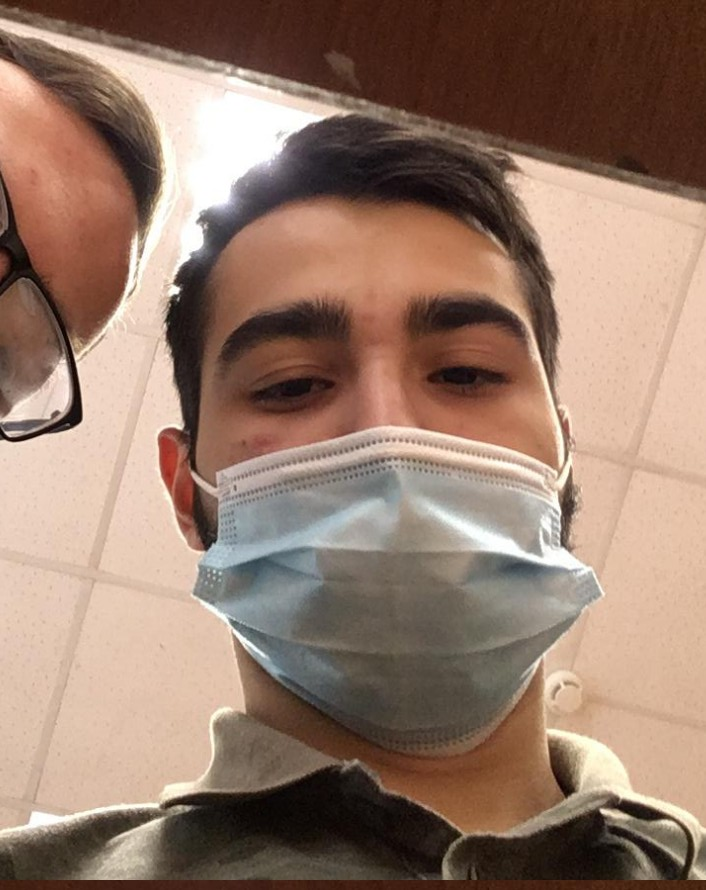

# Using DeepFake

This repository contains the source code for the 
[First Order Motion Model](https://github.com/AliaksandrSiarohin/first-order-model/), 
config ```data/vox-256.yaml```

## Example animations

This is animated sequences with motion transferred from the driving video and object taken from the 
source image.

 

[Video in google drive](https://drive.google.com/drive/folders/1CVjvgMlOZGCcaoa46V4tM4L1R7agGnym?usp=sharing)

## Scaling Video

All video do pre-processing in ```best_frame``` from ```create_video.py``` and new video focus on foreground face
this procced you may see in:
```
python create_video.py "your video"
```
This make easer work for nn and high quality DeepFake video. Its achieved with Opencv2 - Haar Cascade.
And same for image in ```search_face``` from ```create_video.py```

### Installation

[Weight nn and source video](https://drive.google.com/drive/folders/1CVjvgMlOZGCcaoa46V4tM4L1R7agGnym?usp=sharing)

### Image animation

In order to animate videos run:
```
python make_deep_fake.py --image="source image" --video="driving video"
```

### Far ahead (To Do)

* add swap-face
* add model for 512 pix image
* flexible code
* work on other language
* add new NeuralNetwork for DeepFake
